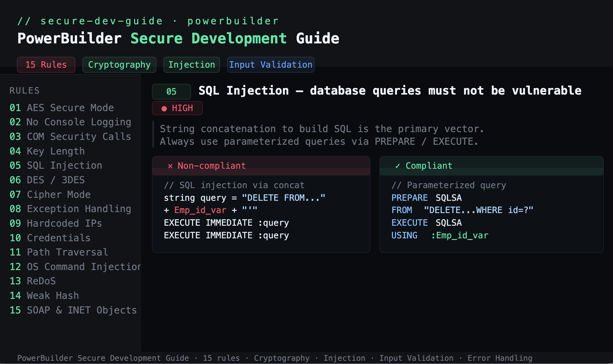

# powerbuilder-secure-development-guide

> Static analysis rules and secure coding patterns for PowerBuilder applications.  
> Covers cryptography, SQL injection, input validation, error handling, and more.



---

## Overview

This guide documents **15 security rules** identified during manual AppSec reviews  
of enterprise PowerBuilder codebases. Each rule includes:

- A clear description of the vulnerability
- Non-compliant code examples
- Compliant alternatives
- Severity classification (High / Medium / Info)

Built as a single self-contained HTML file — no dependencies, no build step.

---

## Rules

| # | Rule | Severity |
|---|------|----------|
| 01 | Always use AES in a secure cipher mode (avoid ECB) | 🔴 High |
| 02 | Never use console logging in production | 🟡 Medium |
| 03 | Do not use CoSetProxyBlanket or CoInitializeSecurity | 🔴 High |
| 04 | Cryptographic keys must meet minimum length (RSA ≥ 2048-bit) | 🔴 High |
| 05 | Database queries must not be vulnerable to SQL injection | 🔴 High |
| 06 | DES and 3DES must not be used | 🔴 High |
| 07 | Use correct cipher mode and padding scheme combinations | 🔴 High |
| 08 | Generic exceptions must not be silently ignored | 🟡 Medium |
| 09 | IP addresses must not be hardcoded | 🟡 Medium |
| 10 | User IDs and passwords must not be hardcoded | 🔴 High |
| 11 | User input must not allow path traversal attacks | 🔴 High |
| 12 | OS commands must not be constructed from user input | 🔴 High |
| 13 | Regular expressions must not be generated from user input (ReDoS) | 🟡 Medium |
| 14 | Cryptographic hashes must not use SHA-1 or MD-family algorithms | 🔴 High |
| 15 | SOAP and INET objects must not be used (no TLS 1.2/1.3 support) | 🔴 High |

---

## Usage

Clone the repo and open the guide directly in your browser:

```bash
git clone https://github.com/your-username/powerbuilder-secure-development-guide.git
cd powerbuilder-secure-development-guide
open index.html
```

No server required. No dependencies. Works offline.

---

## Background

Developed during AppSec engagements on legacy enterprise systems built with  
PowerBuilder — a platform widely used in banking, insurance, and capital markets.  
These rules were validated through manual code review and static analysis.

---

## Disclaimer

This guide is intended for educational and internal review purposes.  
Code examples are simplified for clarity — adapt patterns to your specific context.

---

## References

- [NIST SP 800-57 — Key Management Guidelines](https://csrc.nist.gov/publications/detail/sp/800-57-part-1/rev-5/final)
- [OWASP SQL Injection Prevention](https://cheatsheetseries.owasp.org/cheatsheets/SQL_Injection_Prevention_Cheat_Sheet.html)
- [OWASP Path Traversal](https://owasp.org/www-community/attacks/Path_Traversal)
- [NIST — 3DES Deprecation](https://csrc.nist.gov/News/2023/nist-withdraws-tdea-guidelines)
- [SWEET32 Attack on 3DES](https://sweet32.info/)